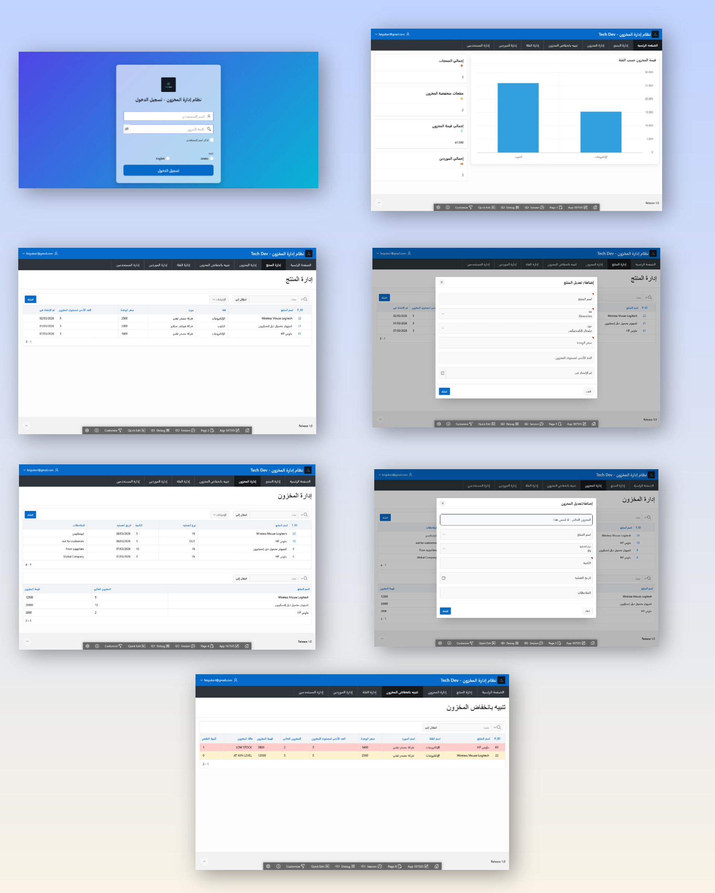
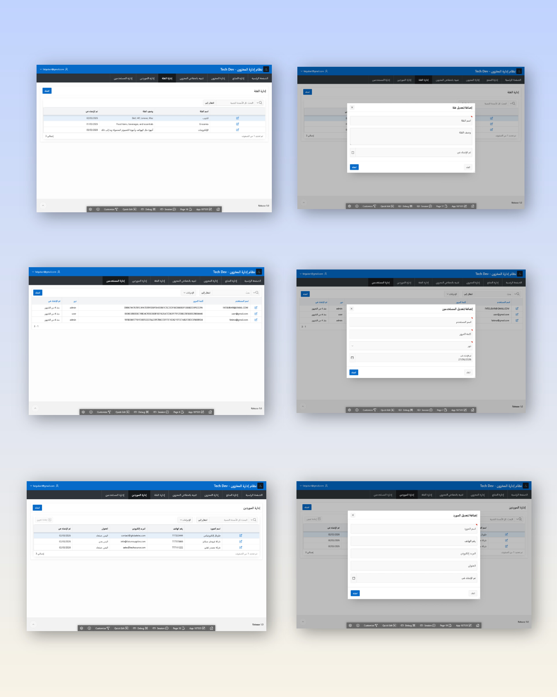
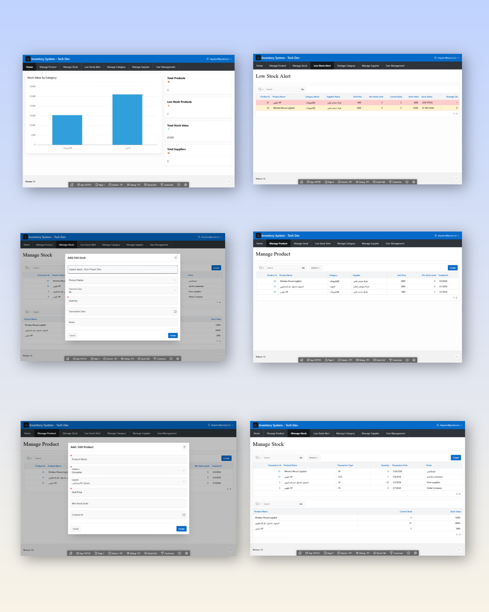
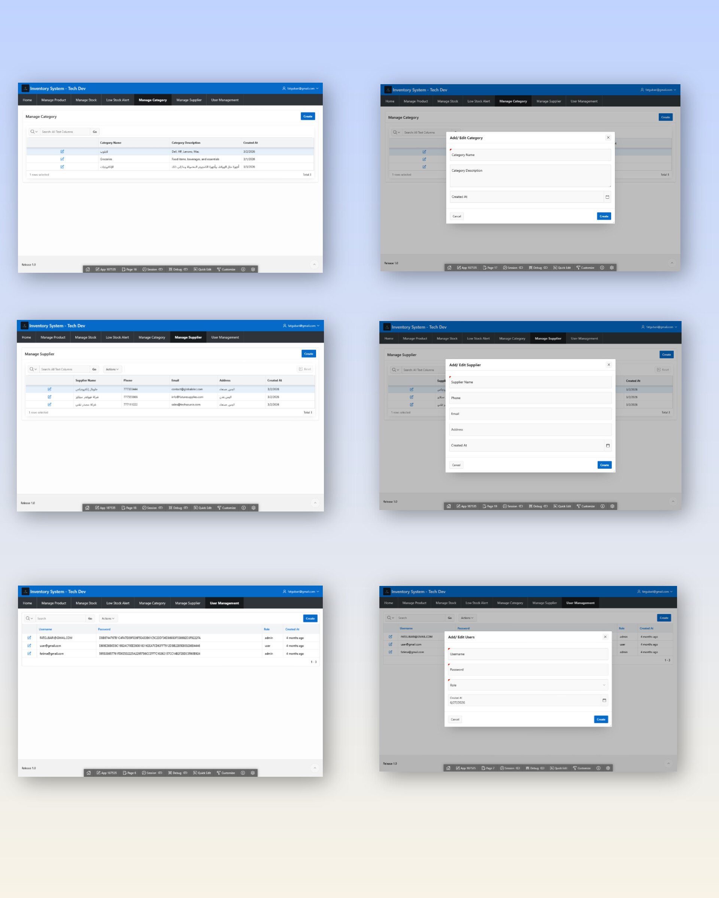

## Inventory Management System By Tech Dev
It's an invertory system for streamline inventory operations. Implemented modules for product, supplier, purchase, and stock management, 
including low-stock alerts, dashboards, and reports to support efficient inventory control.

## Getting Started
Download the sql file and than upload it to Oracle APEX Workspace

## System Photos:

